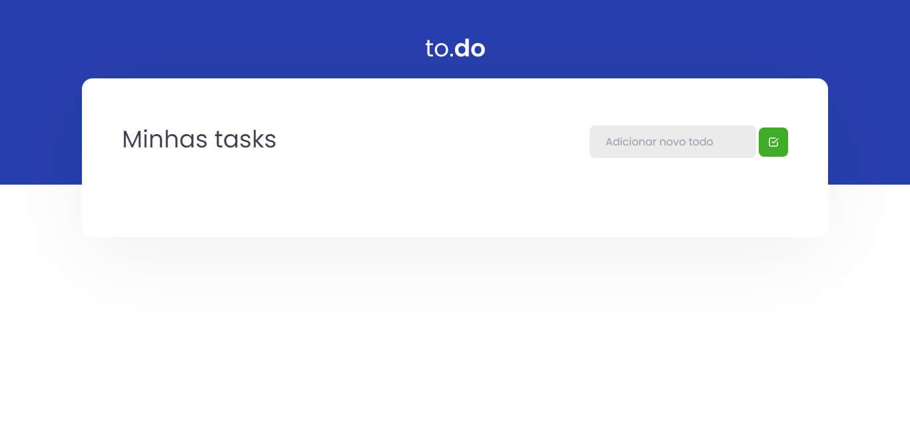

<h1 align="center">To.do</h1>
<h1 align="center"></h1>

### 📚 Sobre

To.do ou to.do é um aplicativo web de gerenciamento de tarefas, este aplicativo é um desafio do primeiro módulo - Fundamentos do ReactJS, do Ignite feita pela Rocketseat.
O intuito do desafio foi colocar em prática o que foi aprendido no primeiro módulo, como: Webpack, Babel, Webpack Dev server, SASS, Source Maps, Fast Refresh e conceitos importantes do React como componentes, propriedades, estados e hooks além de aplicar o TypeScript no projeto para adicionar tipagem estática à aplicação.

### 🎨 Detalhe

Fiz implementações no desafio, como adicionar um modal de erro caso o input esteja vazio ao tentar adicionar uma nova tarefa, para isso utilizei bootstrap e jquery e criei um novo componente react.

### 🔥 Como contribuir

1. Fork este repositório;
2. Crie uma branch com sua feature: ** `git checkout -b my-feature` **;
3. Faça commit de suas mudanças: ** `git commit -m 'feat: My new feature'` **;
4. Envie para a branch: ** `git push origin my-feature` **.

Depois de fazer o 'merge' de seu pull request, você pode excluir seu branch.

### 💻 Tecnologias utilizadas

Neste Aplicativo de Finanças foram utilizadas as seguintes tecnologias

- [HTML](https://www.w3schools.com/html/)
- [CSS](https://www.w3schools.com/css/)
- [Bootstrap](https://getbootstrap.com/)
- [JavaScript](https://www.w3schools.com/js/)
- [TypeScript](https://www.typescriptlang.org/)
- [SASS](https://sass-lang.com/)
- [React](https://pt-br.reactjs.org/)

### 📃 Licença

Este projeto está sobre a licença <a href="https://github.com/GilbertoASJ/To-do/blob/main/LICENSE">MIT</a>